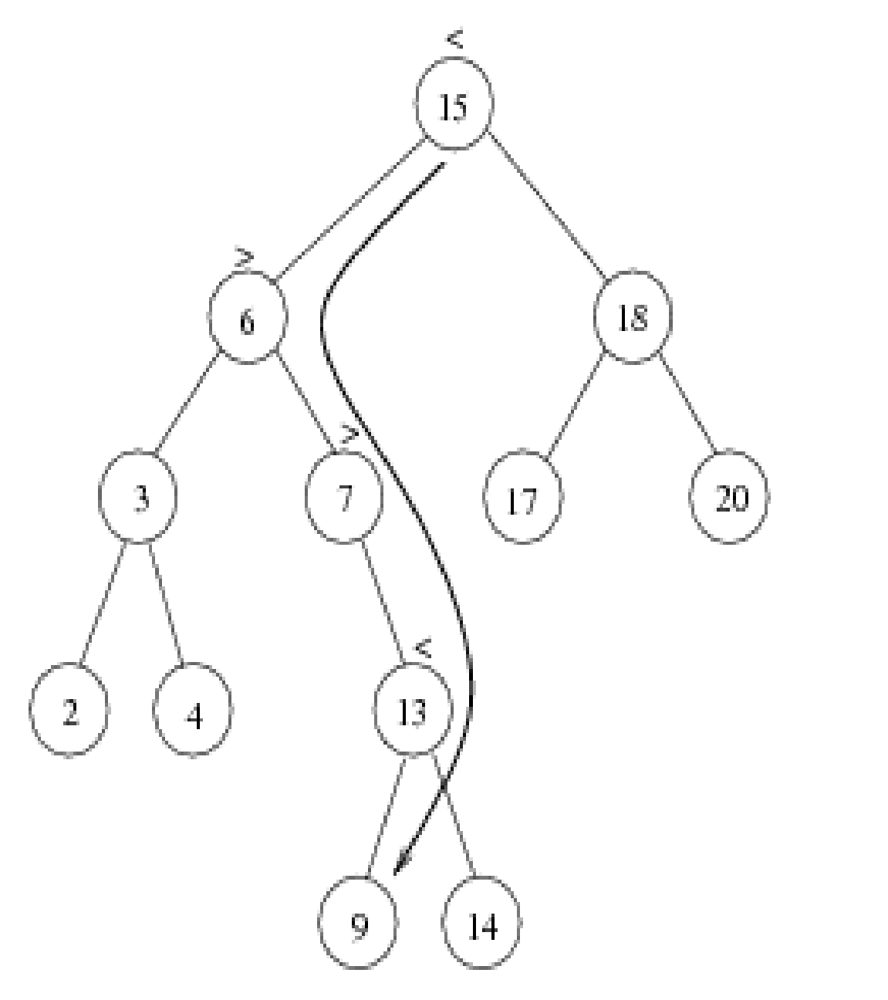

# Binary tree structure

## Performing a search BST
Time complexity O(height of tree)

## Find min value
Returns the node of the far left possible of a BST

## Find max value
Returns the node of the far right possible of a BST

## Inserting a node to the tree

## Deleting a node from a tree

The File `BinTree.java` contains the implementation of it
The file `Main.java` contains the use case of it